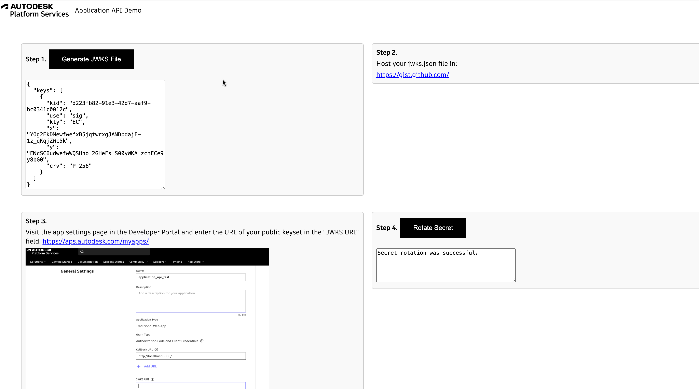

# Application Management API(Node.js)


[](https://nodejs.org)
[](https://www.npmjs.com/)
[](https://opensource.org/licenses/MIT)

Using the [Application API](https://aps.autodesk.com/en/docs/applications/v1/developers_guide/overview/), you can rotate your APS applications' secrets automatically.



Typically, code you adapt from this sample would be deployed to an environment that can run jobs on a regular schedule, such as AWS Lambda, Azure Functions, or a server with cron.

### Prerequisites

- [APS credentials](https://forge.autodesk.com/en/docs/oauth/v2/tutorials/create-app)
- [Node.js](https://nodejs.org) (Long Term Support version is recommended)
- Command-line terminal such as [PowerShell](https://learn.microsoft.com/en-us/powershell/scripting/overview)
  or [bash](<https://en.wikipedia.org/wiki/Bash_(Unix_shell)>) (should already be available on your system)

> We recommend using [Visual Studio Code](https://code.visualstudio.com) which, among other benefits,
> provides an [integrated terminal](https://code.visualstudio.com/docs/terminal/basics) as well.

### Setup & Run

- Clone this repository: `git clone https://github.com/autodesk-platform-services/application-management-api-sample`
- Go to the project folder: `cd application-management-api-sample`
- Install Node.js dependencies: `npm install`
- Open the project folder in a code editor of your choice (Visual Studio Code)
- Replace `<client-id>` and `<client-secret>` with your APS Client ID and Client Secret in secrets.json

```bash
 "CLIENT_ID":  "<YOUR CLIENT_ID>",
  "CLIENT_SECRET": "<YOUR CLIENT_SECRET>"
```

- run `npm start`

## Configuration

1. Click on create keypair.js button to create a new key pair.
1. The previous step will create a `jwks.json` file. Upload this file to your server (for testing purposes, a simple way to host a text file is on [gist.github.com](https://gist.github.com)). How you choose to host your public keyset is up to you, but the keyset must be publicly accessible on the internet and your server must respond with raw JSON.
1. Visit the app settings page in the [Developer Portal](https://aps.autodesk.com) and enter the URL of your public keyset in the "JWKS URI" field.
   Note:- Please make sure that you select Application Management API from the list of APIs dropdown list.
1. Add your application's `client_id` and `client_secret` to the secret manager (if you have not yet customized the mock secrets manager, you will do this by editing `secrets.json`).

## Run the rotation script

```sh
Click on rotate secret button
```

This will rotate the secret and store the new value.

## Customization

This code is intended as a simplified example; it will need modification to integrate smoothly with your deployments and avoid downtime.

### Secrets manager

In a production environment, it's **_strongly_** recommended that you do not use the mock secrets manager provided in this sample.

You can customize the file `lib/secrets-manager.js` to make calls to a real secrets manager, such as AWS Secrets Manager, Azure Key Vault, or comparable device.

### Zero-downtime rotation

In order to avoid downtime during rotation, your application will need several additional features:

1. Logic to handle _two_ client_secret values during the switchover. When requesting access_tokens, the app should try one value, and if that fails, try the second.
1. Prior to committing the rotation, the rotation script needs to wait for the application to become aware of the new secret. This could be done by sending a webhook, or a simple time delay if the application is regularly polling the secrets manager.

### Key Management

The sample includes code to generate keypairs and signatures using the node.js `jose` library. This is sufficient for many uses, however The file `lib/key-management.js` can be customized to use an external key management service if desired. Products such as AWS KMS, Azure Key Vault, or a hardware security module (HSM) have the additional advantage that private keys cannot be exported.

## Troubleshooting

Please contact us via https://forge.autodesk.com/en/support/get-help.

## License

This sample is licensed under the terms of the [MIT License](http://opensource.org/licenses/MIT).
Please see the [LICENSE](LICENSE) file for more details.
